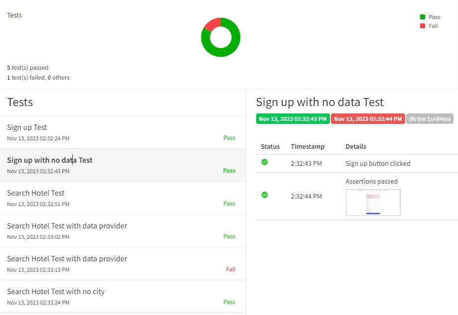

# PHPTRAVELS-page-test
> This repository contains a simple Java Selenium automation project for web testing http://www.kurs-selenium.pl/demo/ page. The project uses Maven for dependency management and project build.

## Table of Contents
* [General Info](#general-information)
* [Technologies Used](#technologies-used)
* [Features](#features)
* [Screenshots](#screenshots)
* [Setup](#setup)

## General Information
- The goal of this project is to demonstrate basic web automation using Java and Selenium WebDriver. 
- The tests include common scenarios such as navigating to a website, interacting with web elements, and performing assertions.
- Page Object Pattern
- Project includes generation of a simple report through the use of ExtentReports.

## Technologies Used
- Java - version 17.0.8
- Maven - version 4.0.0
- Selenium Web Driver - version 4.11.0
- Extent Reports - version 3.1.5

## Features
Automated features:
- Creating account with data test
- Creating account with no data test
- Searching for hotel test
- Searching for hotel with no data test
- Searching for hotel with data provider (loading excell file)

Other features:
- Taking screenshots from tests results (saved as actual date and time)
- Generating simple report from all tests as index.html file
- Loading test data from .xlsx file (excell)

## Screenshots

## Setup
Before running the tests, ensure you have the following installed on your machine:
- [Java Development Kit (JDK)](https://www.oracle.com/java/technologies/javase-downloads.html)
- [Maven](https://maven.apache.org/download.cgi)

1. Clone the repository: git clone https://github.com/mHonc/PHPTRAVELS-page-test.git
2. Navigate to the project directory: cd PHPTRAVELS-page-test
3. Build the project using Maven: mvn clean install
4. Run the tests using Maven: mvn test

